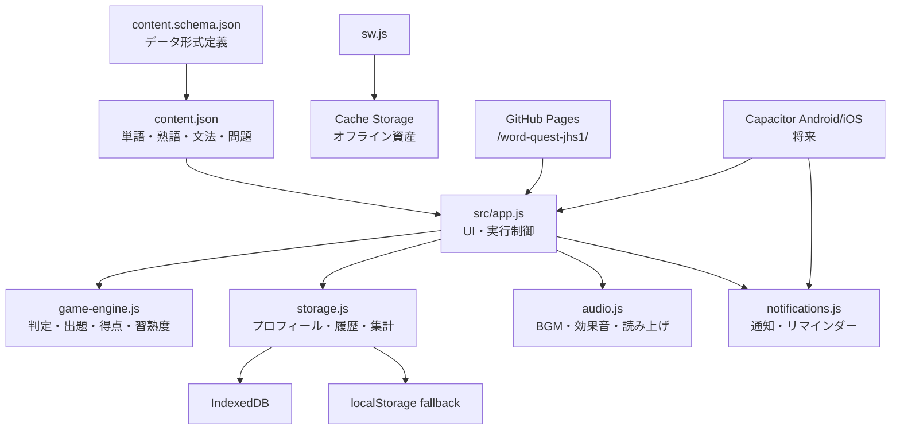

# WORD QUEST 技術設計

## 1. 文書の位置づけ

本書は、息子さん1人が主にスマートフォンで使う英語学習ゲームを、Web-firstのPWAとして完成させ、将来CapacitorでAndroid／iOSへ移行するための設計です。

2026-07-23時点の実装を確認して記載しています。正式公開先はGitHubリポジトリ`word-quest-jhs1`のGitHub Pagesです。78問、今日のクエスト4カテゴリ、端末内保存、Speech Synthesisによるリスニング、リポジトリ配下へ配置するためのbase path対応まで実装済みです。`npm test`は21件すべて成功し、`VITE_BASE_PATH=/word-quest-jhs1/`の一時ビルドも成功しています。音が実際に聞こえるかと発音品質は自動テストでは判定できません。

## 2. 設計判断

| 項目 | 判断 |
|---|---|
| 初期提供形態 | Viteで構築する静的PWA |
| 主利用者 | 1人の子ども、1プロフィール |
| 配信 | GitHub Pages、リポジトリ`word-quest-jhs1`配下 |
| 学習コンテンツ | 版管理されたJSONをアプリへ同梱 |
| 学習記録 | IndexedDB、失敗時は`localStorage`、最後にメモリへフォールバック |
| サーバー | 初期版にはAPI、認証、DB、プッシュサーバーを置かない |
| オフライン | Service Workerで静的ファイルとコンテンツをキャッシュ |
| 音 | Web Audioによる合成BGM／効果音、Web Speech APIによる読み上げ |
| 通知 | Webは表示中のアプリ内リマインダー中心、ネイティブ版はCapacitor Local Notifications |
| ネイティブ移行 | Web実機検証後にCapacitor 8でAndroid、次にiOS |

この構成では、GitHub Pagesへ学習履歴を送らずにゲームを更新できます。一方、端末間同期、保護者の別端末への通知、複数ユーザーは初期範囲外です。

## 3. 全体アーキテクチャ



`src/app.js`は図の調停役です。DOM描画だけでなく、コンテンツの読込、学年の解決、セッション開始、回答処理、習熟度更新、保存、音、通知、Service Worker登録を順序立てて接続しています。

## 4. 現在のファイルと責務

| パス | 状態 | 責務 |
|---|---|---|
| `index.html` | 実装済み | アプリシェル、上部状態、本文、下部ナビ、トースト、演出レイヤーを定義。`src/app.js`を参照 |
| `src/styles.css` | 実装済み | モバイル中心のゲームUI、背景、カード、問題、履歴、設定、レスポンシブ、低減モーション用スタイル |
| `src/game-engine.js` | 実装・単体テスト済み | 回答正規化、正答判定、決定的シャッフル、日次・苦手・タイムアタック出題、得点、習熟度、統計 |
| `src/storage.js` | 実装・単体テスト済み | 単一プロフィール、設定、セッション、回答、習熟度、日別集計、バックアップ、復元、初期化 |
| `src/audio.js` | 実装済み | Web Audio合成音、テーマBGM、効果音、英語読み上げ、音量設定 |
| `src/notifications.js` | 実装済み | 設定、許可、テスト通知、学校／深夜時間の検証、アプリ内監視、Capacitor注入口 |
| `src/app.js` | 実装済み | 初回設定、画面遷移、5学習モード、4つの今日カテゴリ、7問題形式、履歴、設定、保護者PIN、バックアップ、音・通知・PWA接続 |
| `src/question-categories.js` | 実装・単体テスト済み | 単語、文法、リスニング、全部ミックスの分類と日次キュー |
| `src/question-audio.js` | 実装・単体テスト済み | 問題形式ごとに読み上げる単語・完成英文・`audioText`を解決 |
| `public/data/content.json` | 実装・検証済み | 学習コンテンツ`1.1.0`、78問 |
| `schemas/content.schema.json` | 実装済み | コンテンツ形式と最低件数を表すJSON Schema |
| `docs/schema.sql` | 設計資料 | 将来SQLiteを採用する場合の表・索引・参照トリガー。現在のWebランタイムでは未使用 |
| `public/manifest.webmanifest` | 実装済み | PWA名、色、表示形式、192px／512px PNGアイコン、ショートカット |
| `public/sw.js` | 実装・登録処理接続済み | コア資産キャッシュ、ナビゲーションのネットワーク優先、静的資産のstale-while-revalidate |
| `tests/e2e.mjs` | 実装済み | 4カテゴリ表示、ミックス出題、履歴、永続化、オフライン、バックアップ、PIN、誤答フローを検証 |
| `gh-pages`ブランチ | 配信用 | 検証済みの`dist/`のみを置くGitHub Pages公開元 |
| `vite.config.js` | 実装・ビルド確認済み | `VITE_BASE_PATH`またはGitHubリポジトリ名からViteの`base`を解決 |
| `capacitor.config.json` | 実装済み | `jp.wordquest.app`、`WORD QUEST`、`dist`を定義 |
自動テスト21件とGitHub Pages用base pathのビルドは確認済みです。通知許可、音の聞こえ方、実スマホへのPWAインストールは別途実機確認が必要です。

## 5. 実行フロー

### 5.1 起動

1. `src/app.js`から`${import.meta.env.BASE_URL}data/content.json`を取得します。
2. `storage.ready()`を待ち、端末内のプロフィール、設定、習熟度、履歴を読みます。
3. 保存済みの学年をコンテンツ側の学年コードへ正規化します。
4. URLの`mode`、初回設定の有無、直前状態から表示画面を決めます。
5. Service Workerを登録します。
6. 音と通知の設定を画面へ反映します。音声コンテキストと通知許可はユーザー操作より前に要求しません。

### 5.2 学習セッション

1. `storage.createSession()`でセッションを開始します。
2. 今日の学習は`buildCategorizedDailyQueue()`、苦手克服は`buildWeaknessQueue()`、タイムアタックは`buildTimeAttackQueue()`を使います。
3. 4択では選択値、入力では入力文字列、語順では完成した英文を`checkAnswer()`へ渡します。
4. `calculateScore()`で得点と回答後のコンボを算出します。
5. `updateMastery()`で次回復習日時と苦手度を更新します。
6. `storage.recordAttempt()`と`storage.saveMastery()`を待ってから次問へ進みます。
7. 終了時に`storage.finishSession()`を1回だけ呼び、経過時間を日別集計へ加えます。

`recordAttempt()`は問題数・正誤・得点・最大コンボを日別集計へ加え、`finishSession()`は学習時間を加えます。UI側で同じ値を別途加算すると二重計上になるため避けます。

### 5.3 画面状態

複雑なルーターを追加せず、単一のアプリ状態から次のビューを描画しています。

- 初回学年選択
- ホーム
- モード／時間選択
- 問題
- 回答フィードバック
- 結果
- 学習履歴
- 保護者向け記録
- 設定

ブラウザ戻る操作、ページ再読込、タイムアタック中断時の扱いを統一するため、画面状態と永続記録を分けます。途中の一時的な選択状態はメモリ、完了した回答とセッションは保存層へ置きます。

## 6. コンテンツ設計

### 6.1 現在の件数

`public/data/content.json`の版は`1.1.0`です。

| 種別 | 件数 |
|---|---:|
| 小学校復習単語 | 12 |
| 中学1年単語 | 12 |
| 単語合計 | 24 |
| 熟語・定型表現 | 12 |
| 文法単元 | 10 |
| 明示問題 | 78 |
| リスニング問題 | 24 |

問題形式の内訳は、`en_to_ja_choice` 10問、`ja_to_en_choice` 10問、`spelling` 8問、`fill_blank` 10問、`word_order` 10問、`conversation_choice` 6問、`listening_choice` 24問です。リスニング問題は表示用プロンプトに英語の正解を出さず、読み上げ用の`audioText`を持ちます。全問が`hint`、`explanation`、`difficulty`を持ちます。

今日のクエストは`word`、`grammar`、`listening`、`mixed`の4カテゴリです。個別カテゴリは他カテゴリを混ぜず、問題数が足りない場合は同じカテゴリ内で復習サイクルを作ります。`mixed`は出題数のおよそ25%をリスニングにし、残りを非リスニング問題から選びます。

### 6.2 参照関係

問題の`contentType`は`word`、`phrase`、`grammar`のいずれかで、`contentId`が対応コレクションのIDを参照します。アプリ起動時にコンテンツを次のMapへ変換すると、画面表示と学年解決が簡単になります。

```js
const wordsById = new Map(content.words.map((item) => [item.id, item]));
const phrasesById = new Map(content.phrases.map((item) => [item.id, item]));
const grammarById = new Map(content.grammarUnits.map((item) => [item.id, item]));
```

### 6.3 学年コードの互換処理

コンテンツは`elementary`／`jhs1`を使用します。一方、`storage.js`の既定プロフィールは`selectedGrades: ["junior_1"]`、`docs/schema.sql`の既定値は`["jhs1"]`です。

`src/app.js`の`normalizeGrades()`が古い`junior_1`を`jhs1`へ変換するため、現在のUIでは互換性を保ちます。将来のスキーマ更新時には保存値を`elementary`／`jhs1`へ移行し、変換を整理します。

問題オブジェクト自体には`grade`がありません。実装済みの`questionGrade()`が`contentType`／`contentId`から単語、熟語、文法の参照先を引き、その`grade`を返します。`activeQuestions()`は選択学年と一致する問題だけを各モードへ渡します。概念的には次の処理です。

```js
const gradeByContentId = new Map([
  ...content.words.map((item) => [item.id, item.grade]),
  ...content.phrases.map((item) => [item.id, item.grade]),
  ...content.grammarUnits.map((item) => [item.id, item.grade]),
]);

const questionsForGrade = content.questions.filter(
  (question) => gradeByContentId.get(question.contentId) === selectedGrade,
);
```

### 6.4 データ更新

- 問題をJavaScriptへ直接埋め込まず、JSONを更新します。
- `contentVersion`は互換性のある追加でpatch、形式追加でminor、破壊的変更でmajorを上げます。
- `npm test`で最低件数、ID一意性、参照、選択肢、正答、語順カード、カテゴリ分離、`audioText`、読み上げ英文を確認します。
- Service Workerへ同梱するデータを変更した場合は、必要に応じて`CACHE_VERSION`も更新し、古いキャッシュを確実に破棄します。
- 教科書本文や市販教材を転載せず、`source`と`license`を維持します。

## 7. ゲームエンジン

`src/game-engine.js`はDOMやブラウザAPIに依存しないため、WebとCapacitorで共用します。

### 7.1 回答判定

- Unicode NFKCで全角英数字を正規化
- 連続空白、ゼロ幅文字、スマートアポストロフィを正規化
- 既定では大文字・小文字を区別しない
- 必要に応じて文末句読点を無視
- 複数の受理解答に対応

語順問題は、UIでカード順を英文へ連結し、`correctAnswer`と照合します。表示用句読点を付ける箇所を一つに決め、カード側と回答側で二重に付けないようにします。

### 7.2 得点

| 要素 | 現在値 |
|---|---:|
| 正解基本点 | 100 |
| 速答ボーナス | 最大50 |
| 最大速答扱い | 2秒以内 |
| 速答ボーナス終了 | 10秒以上 |
| 難易度1段階ごと | 10 |
| 復習成功 | 25 |
| ヒントなしスペル | 25 |
| ノーミス | 100 |

コンボ倍率は5回で1.2倍、10回で1.5倍、20回で2倍、30回で3倍です。`calculateScore()`へ渡す`combo`／`comboBefore`は回答前の連続正解数で、返り値の`combo`が今回回答後の値です。

### 7.3 習熟度と復習

復習間隔は0、1、3、7、14、30日です。正解で段階を進め、不正解では2段階下げて即時復習へ戻します。4択などの認識問題だけでは習熟度3が上限で、スペル、空欄、語順などの産出問題に正解すると4以上へ進めます。

苦手度は誤答数、誤答率、習熟段階、平均回答時間、期限超過、明示的難易度を使って順位付けします。日次キューは復習、新規、熟語、文法を重複なしで混ぜ、不足分を残りの問題で埋めます。

## 8. 端末内保存

### 8.1 実行時ストレージ

`WordQuestStorage`は次の順で保存先を選びます。

1. IndexedDBデータベース`word-quest`
2. `localStorage`キー`word-quest:data:v1`
3. メモリのみの保存

IndexedDBには次の6ストアがあります。

- `profiles`
- `settings`
- `sessions`
- `attempts`
- `mastery`
- `dailySummaries`

プロフィールIDは`local-player`、設定IDは`app-settings`で固定です。日付は端末ローカル日の`YYYY-MM-DD`を使います。

メモリへフォールバックした場合、ページを閉じると記録が消えます。UIは`storage.backendType`と`fallbackReason`を確認し、永続保存できない場合に保護者へ短い警告を表示する設計にします。

### 8.2 オリジン境界

ブラウザ保存はURLのオリジンごとに分かれます。`localhost`、LANのIPアドレス、旧Netlify URL、GitHub Pages URLは別の保存領域です。旧公開先の記録はGitHub Pagesへ自動移行しないため、必要ならJSONバックアップと復元を使います。

同じ本番URLへ再デプロイするだけなら通常は保存領域が維持されますが、ブラウザデータ削除やサイトURL変更では失われます。

### 8.3 バックアップ

保存層には`exportData()`、`importData()`、`resetData()`があります。バックアップ形式は`word-quest-backup`、スキーマ版は1です。インポートは既定で全置換、`{ mode: "merge" }`で結合します。

設定画面にバックアップのダウンロードと復元用ファイル選択があります。出力名は`word-quest-backup-YYYY-MM-DD.json`です。Chrome E2EではダウンロードしたJSONを解析し、`word-quest-backup`形式と完了セッション1件以上を確認しました。復元時は`format`を確認し、既存データを全置換します。

### 8.4 SQLite資料との関係

`docs/schema.sql`は将来ネイティブ側でSQLiteを採用するときの正規化設計です。現在のPWAはこのSQLを読み込まず、SQLiteプラグインも導入していません。IndexedDBからSQLiteへ移行する場合は、ストアごとの変換、版管理、トランザクション、失敗時ロールバックを別途実装します。

## 9. 音と読み上げ

`audio.js`は外部音源をダウンロードせず、Web Audioのオシレーターで音を生成します。

- BGMテーマ: `home`、`battle`、`boss`、`timeAttack`、`result`
- 効果音: `click`、`correct`、`wrong`、`combo`、`attack`、`bossDefeat`、`item`、`highScore`、`levelUp`
- 読み上げ: 端末のSpeech Synthesis、既定`en-US`
- 設定保存: `wordQuest.audio.settings.v1`

24問の`listening_choice`は明示的な`audioText`を読み上げます。`question-audio.js`は、ほかの形式では単語、空欄を埋めた完成文、語順問題の正答文、会話の質問文を解決します。

ブラウザは自動再生を制限するため、最初のタップで`unlockAudio()`を呼びます。自動テストはSpeech Synthesisを模擬し、渡す英文、`en-US`、英語音声の選択を確認しますが、音そのものは評価できません。本体音量、消音モード、自動再生制限、端末に入っている声、発音品質、BGM／効果音との音量バランスはAndroid ChromeとiPhone Safariで耳で確認する必要があります。

## 10. 通知

`notifications.js`の既定値は次のとおりです。

- 無効状態で開始
- 通知時刻19:00
- 静かな時間21:00〜07:00
- 学校時間08:00〜16:00
- 設定保存キー`wordQuest.notification.settings.v1`

### 10.1 Web

Web Notification APIが使える場合、許可後にテスト通知を表示できます。Service Workerが登録済みなら`registration.showNotification()`、なければページ所有の`Notification`を試します。

定時通知について、現在のWebフォールバックは30秒間隔のアプリ内監視です。ページまたはPWAが動作している間だけ確実に確認できます。プッシュサーバー、Periodic Background Sync、サーバー側スケジューラーはありません。ブラウザを閉じた状態で毎日同時刻に表示されるとは保証しません。

通知許可は設定画面の明示的な操作から要求します。拒否時は学習を妨げず、設定を無効へ戻して短い説明を表示します。通知の有効化、時刻変更、テスト通知は画面へ接続済みですが、ブラウザごとの許可・拒否・再許可は実操作確認前です。

### 10.2 Capacitor

`@capacitor/local-notifications`は依存関係にありますが、モジュールはブラウザビルドとの分離のため直接importしていません。ネイティブ起動コードで次の接続を行う予定です。

```js
import { LocalNotifications } from "@capacitor/local-notifications";
import { registerCapacitorLocalNotifications } from "./notifications.js";

registerCapacitorLocalNotifications(LocalNotifications);
```

プラグイン接続後はID`71001`で毎日繰り返す端末内通知を登録します。学校時間・静かな時間の検証を通った時刻だけを登録します。実機では、許可前、許可、拒否、アプリ終了、端末再起動、省電力、時刻変更、タイムゾーン変更を確認します。

保護者の別端末へ送る通知はローカル通知では実現できません。将来実装する場合は、保護者同意、認証、端末登録解除、最小データ、配信基盤を含む別設計が必要です。

## 11. PWAとオフライン

### 11.1 Manifest

`manifest.webmanifest`はstandalone表示、テーマ色、縦横両対応、教育／ゲーム分類、今日の学習とタイムアタックのショートカットを定義します。通常アイコンは`public/icon-192.png`、maskableアイコンは`public/icon-512.png`です。Apple Touch Iconにも192px PNGを指定し、SVGはブラウザfaviconとして残しています。

### 11.2 Service Worker

`sw.js`のキャッシュ版は`word-quest-v2`です。インストール時にHTML、manifest、SVG／192px／512pxアイコン、背景、コンテンツを取得し、ビルド済みHTMLからハッシュ付きJS／CSSを見つけてキャッシュします。Service Worker自身の位置からスコープを求めるため、`/word-quest-jhs1/`配下でも相対パスで動作します。

- ページ遷移: ネットワーク優先、失敗時にキャッシュ
- 同一オリジンの静的GET: stale-while-revalidate
- Runtime Cache: 最大100件
- 旧`word-quest-*`キャッシュ: activate時に削除

`src/app.js`はHTTPSまたはlocalhostで次に相当する登録処理を実行します。

```js
if ("serviceWorker" in navigator) {
  window.addEventListener("load", () =>
    navigator.serviceWorker.register(`${import.meta.env.BASE_URL}sw.js`, {
      scope: import.meta.env.BASE_URL,
    }),
  );
}
```

コンテンツやキャッシュ戦略の互換性を変えたときは`CACHE_VERSION`を更新します。Chrome E2Eでは再読込後にService Workerの制御を確認し、ネットワークを強制オフラインへ切り替えた再読込にも成功しました。実スマホでのインストールとオフライン起動は未検証です。

## 12. GitHub Pages配信

正式公開先はGitHubリポジトリ`word-quest-jhs1`のGitHub Pagesです。公開URLは`https://ssshasimotosss-droid.github.io/word-quest-jhs1/`で、現在の検証済み配信コミットは`8f9bbc5`です。HTTP 200と公開URLに対するChrome E2Eを確認済みです。

`main`ブランチにはソース、`gh-pages`ブランチには検証後の`dist/`のみを置きます。GitHub Pagesの公開元は`gh-pages`ブランチのルートです。これにより、現在のGitHub認証にActions workflow書き込み権限を追加せずに配信できます。

公開前に`npm test`と`npm run build:pages`を実行します。`vite.config.js`は`VITE_BASE_PATH=/word-quest-jhs1/`を優先し、`index.html`、CSS、アプリ、manifest、Service Worker、コンテンツをリポジトリ配下の同じbase pathに揃えます。

GitHub Pagesは静的ファイルだけを配信し、学習履歴は受け取りません。記録はIndexedDBまたは`localStorage`に保存され、同じPages URLへの再公開では通常維持されます。旧公開URLとはオリジンが異なるため、必要な記録はJSONバックアップで移します。

`noindex`と`robots.txt`は検索避けであり、アクセス制御ではありません。公開後のPages URLで読込、Service Worker、強制オフライン再読込、IndexedDBの記録保持を確認済みです。

## 13. Android／iOS移行計画

### 13.1 Android

前提として、Web版をブラウザとスマホで確認し、直前の`npm run check`も成功させます。その後、Android StudioとAndroid SDKを用意します。

```bash
npm run cap:add:android
npm run android:open
```

`cap:add:android`はネイティブプロジェクトがない最初の1回だけ使います。以降は次で同期します。

```bash
npm run cap:sync
npx cap open android
```

確認項目は、戻る操作、Safe Area、キーボード、音、読み上げ、端末内保存、バックアップ、通知許可、定時通知、オフライン起動、アプリアップデート後のデータ保持です。

### 13.2 iOS

Android安定後、Capacitorの版を揃えてiOSパッケージを追加します。

```bash
npm install @capacitor/ios@8.4.2
npm run build
npx cap add ios
npx cap sync ios
npx cap open ios
```

Xcodeで署名、Bundle Identifier、アイコン、起動画面、Safe Area、キーボード、通知許可、端末内保存、バックアップ／復元を確認します。AndroidとiOSで同じWebコンテンツを使い、ネイティブ差分はプラグイン登録と端末権限のアダプターへ閉じ込めます。

## 14. プライバシーと安全性

初期版で端末内に保存してよい情報は、ニックネーム、選択学年、設定、学習回答、得点、学習時間、習熟度、日別記録です。本名、住所、電話番号、メールアドレス、位置情報、顔写真は扱いません。

- 広告SDKなし
- 解析SDKなし
- アカウント登録なし
- クラウド同期なし
- 外部ログ送信なし
- カメラ、位置情報、マイク権限なし

音声読み上げは端末提供の音声合成を使います。発音認識は未実装であり、マイク権限を要求しません。GitHub Pagesには静的なアプリと学習コンテンツだけを置きます。

保護者画面は4〜8桁のPINで保護され、閲覧専用で得点を変更できません。PINは可能な環境ではWeb CryptoのSHA-256でハッシュ化して端末設定へ保存し、5回失敗すると30秒ロックします。これは家族内の誤操作防止であり、端末管理者に対する強固な認証ではありません。PIN忘れ時は記録初期化が必要になるため、事前バックアップを案内します。

## 15. 生成画像の来歴

世界観背景はCodex内蔵のimagegenで、本プロジェクト用に生成した画像です。

| 用途 | パス | 仕様 |
|---|---|---|
| 編集・保管用の元画像 | `docs/source-assets/quest-world.png` | PNG、1536×1024 |
| Web実行時 | `public/assets/quest-world.jpg` | JPEG、1536×1024 |

生成プロンプト要約は次のとおりです。

> use case stylized-concept; game home/battle background; luminous grassland path through ancient stone arches to floating magical city; polished anime-inspired environment for ages 12-15; wide/mobile-safe center crop; dawn; deep indigo/electric cyan/warm gold/emerald; no text/logos/characters/watermark.

元画像は`docs/source-assets`に残し、実行時変換物と分離します。CSSは`/assets/quest-world.jpg`を参照し、Service Workerも同パスをコア資産として扱います。

## 16. 実装状況

### E2E再現条件

`playwright-core` 1.61.1は`devDependencies`にあり、`tests/e2e.mjs`はmacOSの`/Applications/Google Chrome.app`を使用します。先に本番previewを既定の4173番ポートで起動し、別ターミナルからE2Eを実行します。

```bash
# ターミナル1
npm run build
npm run preview

# ターミナル2
npm run test:e2e
```

既定URLは`http://127.0.0.1:4173`で、必要なら`WORD_QUEST_URL`で変更できます。スクリーンショットは`tests/screenshots/`へ保存されます。

### 実装済み項目と、自動検証済みの主要導線

- パッケージ、Viteコマンド、GitHub Pages／Capacitor設定
- HTMLアプリシェル、レスポンシブスタイル、背景、演出
- コンテンツJSON、JSON Schema、SQLite設計資料
- 回答判定、出題キュー、得点、コンボ、習熟度、統計ロジック
- IndexedDB／`localStorage`保存、バックアップAPI
- 初回ニックネーム／複数学年選択、ホーム、学習、結果、履歴、設定の画面
- 今日のクエスト4カテゴリ、タイムアタック、苦手、カテゴリ別、ミニボスの5モード
- 4択、スペル、空欄、語順、会話選択、リスニングを含む7問題形式
- やさしい再回答、ヒント、答え・解説、得点、コンボ、パーティクル、振動
- Web Audio／読み上げと設定画面の接続
- Web通知／アプリ内通知、PWAインストール案内、Service Worker登録
- PIN付き閲覧専用保護者レポート、Web Share、バックアップ／復元、初期化UI
- `npm test`: 21件成功、失敗0件
- `VITE_BASE_PATH=/word-quest-jhs1/`のVite 8.1.5ビルドに成功
- Chrome E2Eで今日のクエスト4カテゴリを確認し、全部ミックスにリスニングと非リスニングが含まれることを検証
- 英単語ステージ全12問で、単語以外とリスニング専用問題が混入しないことを検証
- 横方向のはみ出しなし、得点、結果、セッション履歴を確認
- IndexedDBの学習記録が再読込後も保持されることを確認
- Service Worker制御下の再読込と、強制オフライン再読込に成功
- バックアップJSONを解析し、完了セッション1件以上を確認
- 保護者PINの設定、ロック、再解除を確認
- 誤答時のヒント、再挑戦、答え表示を確認
- Console Error／Page Errorは0件
- モバイル4画面とデスクトップ初回画面のスクリーンショットを目視確認
- `VITE_BASE_PATH`と`gh-pages`ブランチによるPages公開経路を実装
- GitHub PagesのHTTPS URLで200応答、サブパス資産、コンテンツ版`1.1.0`を確認
- 公開URLのChrome E2Eで学習、保存、バックアップ、Service Worker、強制オフライン再読込、エラー0件を確認

### 残る実機確認

- BGM、効果音、音声合成の実聴
- 通知の許可、拒否、学校時間／深夜回避、テスト通知
- Android／iPhone実機へのPWAインストール、ホーム画面からの起動、更新

### 将来機能

- 章立ての本格ボス戦、キャラクター育成、アイテム、実績、ミッション
- 発音認識／判定
- 中学2年・3年、英検コンテンツ
- クラウド同期、複数プロフィール
- 保護者の別端末への通知
- Android／iOSネイティブプロジェクトとストア配布

## 17. 既知の統合リスク

1. Chrome E2EはmacOS上のヘッドレス実行であり、Android／iPhone実機の挙動を保証しません。
2. Webの定時通知は、アプリ終了中の確実な配信を保証しません。
3. 旧公開URLとGitHub Pages URLは別オリジンのため、学習記録を共有しません。
4. 192px／512px PNGアイコンは用意済みですが、実スマホでのインストール表示は未検証です。
5. SQLite資料と現在のIndexedDB実装は別物であり、自動同期しません。
6. バックアップ復元は全置換です。ファイル選択後の最終確認と復元前自動バックアップは未実装です。
7. `localStorage`からメモリへ落ちた場合の永続保存不可警告は画面へ接続されていません。
8. `noindex`はアクセス制御ではありません。
9. 保護者PINは同一端末内の誤操作防止であり、強固な本人認証ではありません。
10. Capacitor Local Notificationsプラグインの注入とネイティブ実機検証は未実施です。

## 18. 完了判定

現在の検証状況です。

- [x] `npm test`が全件成功（21/21）
- [x] `VITE_BASE_PATH=/word-quest-jhs1/`のPages用ビルドが成功
- [x] 今日のクエスト4カテゴリと、全部ミックスのリスニング混在をE2Eで確認
- [x] 英単語ステージ全12問のカテゴリ分離をE2Eで確認
- [x] 390×844で横方向のはみ出しなし
- [x] 得点、結果、セッション履歴を確認
- [x] IndexedDBの記録を再読込後に復元
- [x] 保護者PINの設定、ロック、解除
- [x] 誤答時のヒント、再挑戦、答え表示
- [x] Service Worker制御と強制オフライン再読込
- [x] バックアップ出力を解析し、完了セッションを確認
- [x] Console Error／Page Errorなし
- [x] 生成スクリーンショットを目視確認
- [x] `VITE_BASE_PATH`対応と`gh-pages`配信手順を実装
- [x] GitHub Pagesへ正式公開し、HTTPS URLのHTTP 200を確認
- [x] GitHub Pages URLで読込、Service Worker、オフライン、端末内保存を確認
- [ ] BGM、効果音、読み上げの実聴
- [ ] 通知の有効／無効、拒否、学校時間／深夜回避
- [ ] Android／iPhone実機へのPWAインストールとホーム画面からの起動

ネイティブ化後は、これに加えてAndroid／iOS実機で通知、保存、オフライン、アップデート後の記録保持を再確認します。
